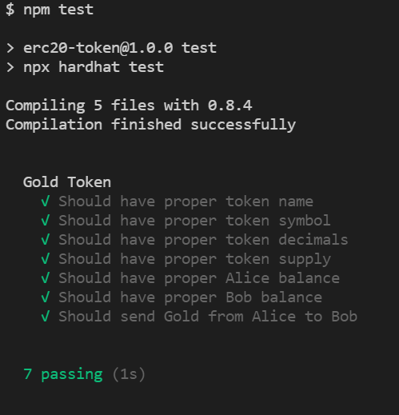

# Gold Token

The goal of this excercise is to create an ERC-20 Smart contract using the Open Zeppelin Libraries.
You can test out your contract with `/tests/GoldToken-Test.js` these will help make sure your Contract passes the requirements. The test also shows how the javascript library [ethers](https://docs.ethers.io/v5/) interacts with the smart contracts. Try and understand what the tests are doing. Tests must be passing for any commits because of the git hooks from [husky](https://typicode.github.io/husky/#/). Solution is in branch [final](https://github.com/soliditystudygroup/ERC20-Token/tree/final).

# Requirements

- ERC20 Contract Inherited from [Open Zeppelin](https://docs.openzeppelin.com/contracts/4.x/erc20)
- name: Gold
- symbol: GLD
- Supply of 1000 GLD to Contract Creator
  - Hints: [Token Supply](https://docs.openzeppelin.com/contracts/4.x/erc20-supply) | [ether units](https://docs.soliditylang.org/en/v0.8.7/units-and-global-variables.html)

# Guide

Pull down this repo and cd into directory

```
$ git clone https://github.com/soliditystudygroup/ERC20-Token
$ cd ERC20-Token
```

Install packages

```
$ npm install
```

Launch VsCode from current directory [troubleshooting Mac](https://code.visualstudio.com/docs/setup/mac#_launching-from-the-command-line)

```
$ code .
```

Write a smart contracts following the [Requirements](#Requirements) until the tests pass

```
$ npm test
```

# Solution

Solution with tests passing can be found in branch `final`

```
$ git checkout final
```



final solidity code [here](https://github.com/soliditystudygroup/ERC20-Token/blob/final/contracts/GLDToken.sol)
